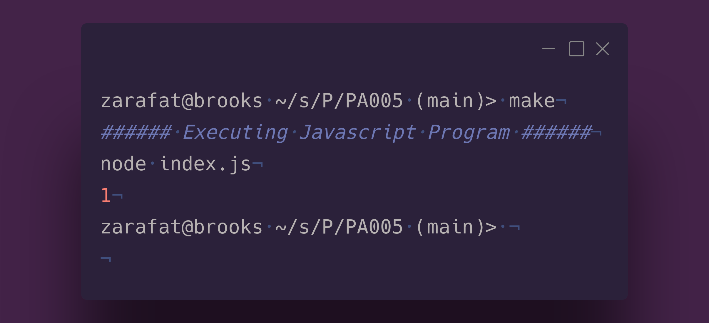

# Scope binding. 

### Ziad Arafat

#### Problem Description
In this experiment we are testing to see if we can determine what kind of binding Javascript uses. Our code has multiple variables and nested functions that will help demonstrate. 
There are 3 possible cases. 

1. **Shallow binding**: In this case, the variable `x` would be shallowly bound. When the function `sub4` calls `sub2` (through the `subx` argument), the value of `x` in the scope of `sub4` would be used. In this case, the output would be `4`, as that is the value of `x` in `sub4`.

2. **Deep binding**: With deep binding, when the function `sub4` calls `sub2`, it would use the value of `x` from the scope in which `sub2` was originally defined (i.e., `sub1`). In this case, the output would be `1`, as that is the value of `x` in `sub1`.

3. **Ad-hoc binding**: In ad-hoc binding, the value of `x` would be determined based on specific rules or conditions. For example, a developer might choose to bind `x` based on a particular condition or flag. The output would depend on the specific implementation and rule defined for ad-hoc binding.

#### Output

#### Conclusion
In JavaScript, the binding behavior is closest to **deep binding**. When `sub2` is called within `sub4`, it references the value of `x` from the scope where it was originally defined (i.e., `sub1`). Therefore, when running this code, the output is `1`.