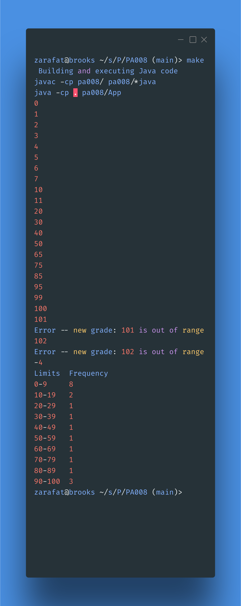

# PA008

## Deliverables

### Name and problem description

1. Ziad Arafat
2. This program demonstrates how exception handling works in different languages
   1. We translated a program written in Ada
      1. The program takes in test scores as inputs then prints out the frequency of each score range. 
   2. The Ada was translated to java
      1. The java code does the same thing as the Ada code but with some changes that make it work well in Java. 

### Our new code

#### App.java
This is the main code that replicates the Ada code. 
```java

/**
 * Ziad Arafat
 * 04/26/2023
 */

package pa008;

import pa008.Natural; // Custom natural class for natural numbers from Ada.
import java.util.Scanner;

/**
 * Exception handling loop example translated from Ada.
 * User inputs grade scores between 0 and 100 and the program counts 
 * the frequencies in each range in an array. 
 * It then prints out the frequencies in a table.
 */
public class App {
        public static void GradeDistribution()
        {
                int[] Freq = new int[10]; // Array of integers initialized to 0

                // Natural number to store the grade
                Natural NewGrade = new Natural(0); 

                // Index: Controls the index to count the score to. 
                // Limit_1, Limit_2 used to store the ranges in the output rable
                int Index, Limit_1, Limit_2;

                // keep asking for a number until the user enters a negative. 
                while (true) {


                        Scanner GradeScanner = new Scanner(System.in);

                        // Try to set the value to what the user entered.
                        // If it's not a natural number break the loop.
                        try {
                                NewGrade.setValue(
                                        GradeScanner.nextInt());

                        } catch (IllegalArgumentException e) {
                                break;
                        }
                        
                        // Set the index to the grade value over 10
                        // This allows us to update the appropriate category
                        // based on. 
                        Index = NewGrade.getValue()/10;

                        // Try to append the grade value.
                        // If it is out of bounds then either error or append
                        // it as the 100 grade
                        try {
                                Freq[Index] = Freq[Index] + 1;
                        } catch (ArrayIndexOutOfBoundsException e) {
                                if (NewGrade.getValue() == 100) {
                                        Freq[9] = Freq[9] + 1;
                                } else {
                                        System.out.print(
                                                "Error -- new grade: ");
                                        System.out.print(NewGrade.getValue());
                                        System.out.println(" is out of range");
                                }
                        }
                }

                // Print a table with all the frequencies. 
                System.out.println("Limits\tFrequency");
                
                for (Index = 0; Index < 10; Index++) {

                        // Sets the bounds of the range
                        Limit_1 = 10 * Index;
                        Limit_2 = Limit_1 + 9;
                        if (Index == 9) {
                                Limit_2 = 100;
                        }
                        
                        System.out.print(Limit_1);
                        System.out.print("-");
                        System.out.print(Limit_2);
                        System.out.print("\t");
                        System.out.println(Freq[Index]);

                }
        }

        public static void main(String[] args) {
                GradeDistribution();
        }
}
```

#### Natural.java
This class is used to implement the same functionality as Ada's Natural type. Because java does not have a native Natural type. It also implements the exception throws when a negative number is passed. 

```java
/**
 * Ziad Arafat
 * 04/26/2023
 */

package pa008;


/**
 * Class to store natural numbers and throw exceptions equivalent to Adas 
 * Contraint errors that natural types can throw. 
 */
public class Natural {
        private int value;

        public Natural(int value) {
                if (value < 0) {
                        throw new IllegalArgumentException(
                                        "Value must be non-negative.");
                }
                this.value = value;
        }

        public int getValue() {
                return value;
        }

        public void setValue(int value) {
                if (value < 0) {
                        throw new IllegalArgumentException(
                                        "Value must be non-negative.");
                }
                this.value = value;
        }
}
```

### A test run of our code
This is the output of running `make` and giving a bunch of test inputs
Screenshot generated with https://carbon.now.sh
